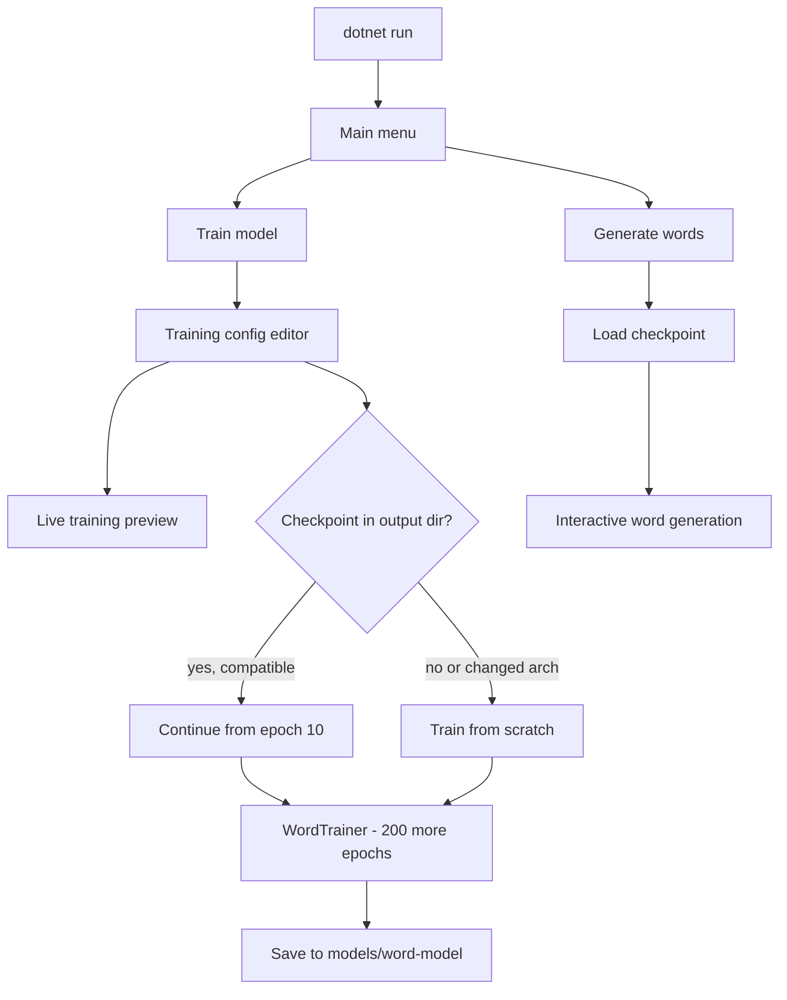

# home-gpt

Interactive console app for training and sampling a **character-level LSTM word model**, built with [TorchSharp](https://github.com/dotnet/TorchSharp) and [Spectre.Console](https://spectreconsole.net/).

## Architecture

The model is a simple character-level language model:

```
Embedding → LSTM → Linear decoder
```

Main menu actions:

- **Train model** — configure hyperparameters and train on a word list
- **Generate words** — sample new words from a trained checkpoint
- **Exit**

Default model output directory: `models/word-model`

## Requirements

- .NET 10 (`net10.0`)
- TorchSharp 0.106.0 with `TorchSharp-cuda-linux` (uses CUDA when available, otherwise CPU)

## Build and run

```bash
dotnet build home-gpt.slnx
dotnet run --project src/home-gpt
dotnet test
```

## Data format

Training data is a plain text file with **one word per line** (default: [`input.txt`](input.txt)).

- Lines starting with `#` are ignored
- The vocabulary is built from every distinct character that appears in the file

## Current training configuration

The values below match the live training preview and editor in the app, with checkpoint state from [`models/word-model/metadata.json`](models/word-model/metadata.json).

### Paths and runtime

| Setting | Value |
|---------|-------|
| Data file | `input.txt` (absolute: `/home/carathorys/src/home-gpt/input.txt`) |
| Output directory | `models/word-model` |
| Device | CUDA |

### Dataset statistics

| Setting | Value |
|---------|-------|
| Words | 161,743 |
| Vocabulary size | 97 |
| Max word length | 38 |
| Sequence length | 39 |

### Training hyperparameters

| Setting | Value |
|---------|-------|
| Epochs | 200 |
| Batch size | 256 |
| Batches per epoch | 632 |
| Total training steps | 126,400 |
| Learning rate | 0.003 |

### Model architecture

| Setting | Value |
|---------|-------|
| Embedding size | 256 |
| Hidden size | 1,024 |
| Parameters | 5,375,329 |
| Model size (float32) | 20.51 MB |

### Checkpoint state

| Setting | Value |
|---------|-------|
| Completed epochs | 10 |
| Checkpoint | Loaded and ready to continue |

When resuming from a checkpoint, the UI labels epochs as **Additional epochs**. With the current settings, training will run **200 more epochs** after the 10 already completed (210 total if training finishes without interruption).

### Editable parameters

These are the values currently configured in the training editor:

| Parameter | Value |
|-----------|-------|
| Data file | `input.txt` |
| Output directory | `models/word-model` |
| Additional epochs | 200 |
| Batch size | 256 |
| Learning rate | 0.003 |
| Hidden layer size | 1,024 |
| Embedding size | 256 |

## Training workflow

1. Run the app and select **Train model**.
2. The configuration editor shows a **live training preview** that updates as settings change.
3. If a checkpoint exists in the output directory, it is loaded automatically and the preview shows completed epochs and checkpoint status.
4. On start, you can **continue from the checkpoint** or **overwrite and train from scratch**.
5. Resume is allowed when the data/vocabulary and model architecture (embedding size and hidden size) match the checkpoint. Changing those critical settings requires overwriting the existing model.
6. Press **Esc** during training to cancel and return to the configuration editor.

### Editor keyboard shortcuts

| Key | Action |
|-----|--------|
| ↑ / ↓ | Select a field |
| Type / + / − | Edit numeric values |
| F | Browse for file or directory paths |
| S | Start training |
| Esc | Back to main menu |



## Generation

1. Run the app and select **Generate words**.
2. If `models/word-model` exists, it is offered as the default; you can also choose another directory.
3. Use the interactive prompt to sample words from the trained model.
