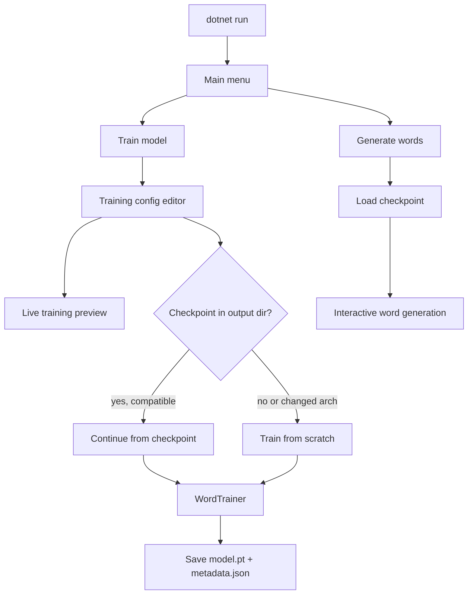

# home-gpt

Interactive console app for training and sampling a **character-level LSTM word model**, built with [TorchSharp](https://github.com/dotnet/TorchSharp) and [Spectre.Console](https://spectreconsole.net/).

## Requirements

- .NET 10 (`net10.0`)
- TorchSharp 0.106.0 with `TorchSharp-cuda-linux` (uses CUDA when available, otherwise CPU)

## Project structure

| Project | Path | Role |
|---------|------|------|
| **home-gpt.Core** | [`src/home-gpt.Core`](src/home-gpt.Core) | Model, training, inference, persistence (UI-agnostic) |
| **home-gpt.Cli** | [`src/home-gpt.Cli`](src/home-gpt.Cli) | Spectre.Console interactive shell |
| **home-gpt.Avalonia** | [`src/home-gpt.Avalonia`](src/home-gpt.Avalonia) | Avalonia desktop UI scaffold (placeholder) |

Each project has a matching test project under [`tests/`](tests/).

## Build and run

```bash
dotnet build home-gpt.slnx
dotnet run --project src/home-gpt.Cli
dotnet run --project src/home-gpt.Avalonia
dotnet test home-gpt.slnx
./scripts/verify-coverage.sh
```

The coverage script runs all tests and verifies **≥ 80% line coverage** per component (`Core`, `Cli`, `Avalonia`).

## Data format

Training data is a plain text file with **one word per line** (for example [`samples/words.txt`](samples/words.txt)).

- Lines starting with `#` are ignored
- Empty lines are skipped
- The vocabulary is built from every distinct character that appears in the file

## Model structure

The model (`CharLanguageModel`) is a character-level language model with three layers:

```
Embedding → LSTM → Linear decoder
```

| Layer | Role |
|-------|------|
| **Embedding** | Maps each character index to a dense vector of size `EmbedSize` |
| **LSTM** | Processes the character sequence; hidden state size is `HiddenSize` |
| **Linear decoder** | Projects LSTM output back to vocabulary logits (one score per character) |

For each word, the model learns to predict the next character given the characters seen so far. Training uses cross-entropy loss with Adam optimization.

### Vocabulary

Characters are assigned integer indices at indices 2 and above. Two special indices are reserved:

| Index | Name | Purpose |
|-------|------|---------|
| 0 | PAD | Padding for unused sequence positions |
| 1 | EOS | End-of-sequence marker after the last character |

`VocabSize` is the total number of indices (special tokens + distinct characters in the training file).

### Sequences

Each word is encoded as a fixed-length sequence:

- **Max word length** — length of the longest word in the dataset
- **Sequence length** — `max word length + 1` (room for the EOS token)

For a word of length *n*, the input is the *n* character indices (padded), and the target is the next character at each position, with EOS after the final character.

## Training parameters

These can be configured in the training editor. The live preview recalculates derived values as settings change.

### Paths

| Parameter | Description |
|-----------|-------------|
| **Data file** | Path to the word list used for training |
| **Output directory** | Where the trained model and metadata are saved (default: `models/word-model`) |

### Dataset statistics (derived)

Computed from the selected data file; not editable directly.

| Parameter | Description |
|-----------|-------------|
| **Words** | Number of non-empty, non-comment lines in the data file |
| **Vocabulary size** | Number of distinct characters plus PAD and EOS |
| **Max word length** | Longest word in the dataset |
| **Sequence length** | `max word length + 1` |

### Hyperparameters (editable)

| Parameter | Description | Default |
|-----------|-------------|---------|
| **Epochs** | Number of full passes over the dataset. When resuming, shown as **Additional epochs** — epochs to run on top of those already completed | 100 |
| **Batch size** | Number of words processed per optimizer step | 32 |
| **Learning rate** | Adam optimizer step size | 0.003 |
| **Hidden layer size** | LSTM hidden state dimension (`HiddenSize`) | 128 |
| **Embedding size** | Character embedding dimension (`EmbedSize`) | 64 |

### Derived training metrics

| Parameter | Formula | Description |
|-----------|---------|-------------|
| **Batches per epoch** | `ceil(word count / batch size)` | Optimizer steps in one epoch |
| **Total training steps** | `batches per epoch × epochs` | Total optimizer steps for the run |
| **Parameters** | — | Total trainable weights in the model |
| **Model size (float32)** | `parameters × 4 bytes` | Approximate on-disk weight size |

### Runtime

| Parameter | Description |
|-----------|-------------|
| **Device** | `cuda` when a GPU is available, otherwise `cpu` |

## Checkpoint format

A trained model is stored as two files in the output directory:

| File | Contents |
|------|----------|
| `model.pt` | TorchSharp model weights |
| `metadata.json` | Architecture, vocabulary, and training state |

### `metadata.json` structure

```json
{
  "VocabSize": 97,
  "EmbedSize": 256,
  "HiddenSize": 1024,
  "SequenceLength": 39,
  "VocabJson": "\" !&'*,-./0123489:;<=>?ABCDEFG...\"",
  "DataPath": "/path/to/training-data.txt",
  "CompletedEpochs": 10,
  "BatchSize": 256,
  "LearningRate": 0.003
}
```

| Field | Description |
|-------|-------------|
| `VocabSize` | Total vocabulary size (must match the trained model) |
| `EmbedSize` | Embedding dimension used during training |
| `HiddenSize` | LSTM hidden size used during training |
| `SequenceLength` | Fixed sequence length derived from the training data |
| `VocabJson` | JSON-encoded string of all training characters (order matters) |
| `DataPath` | Path to the data file used for training |
| `CompletedEpochs` | Total epochs finished across all training runs |
| `BatchSize` | Batch size from the last training run |
| `LearningRate` | Learning rate from the last training run |

`VocabJson` is a JSON string whose characters (after deserialization) are the printable vocabulary entries, in index order starting at 2.

### Checkpoint compatibility

Resume is allowed when the checkpoint matches the current data and architecture:

- **Vocabulary** — same characters and `VocabSize`
- **Sequence length** — same max word length in the data file
- **Architecture** — same `EmbedSize` and `HiddenSize`

Changing embedding or hidden size requires training from scratch (overwrite). The UI shows checkpoint status as **Loaded and ready to continue** when compatible, or a warning when critical settings have changed.

## Training workflow

1. Run the app and select **Train model**.
2. The configuration editor shows a **live training preview** that updates as settings change.
3. If a checkpoint exists in the output directory, it is loaded automatically.
4. On start, choose **continue from checkpoint** or **overwrite and train from scratch**.
5. Press **Esc** during training to cancel and return to the editor.

### Editor keyboard shortcuts

| Key | Action |
|-----|--------|
| ↑ / ↓ | Select a field |
| Type / + / − | Edit numeric values |
| F | Browse for file or directory paths |
| S | Start training |
| Esc | Back to main menu |



## Generation

1. Run the app and select **Generate words**.
2. Choose a directory containing a trained checkpoint (`model.pt` and `metadata.json`).
3. Use the interactive prompt to sample new words character by character from the model.
